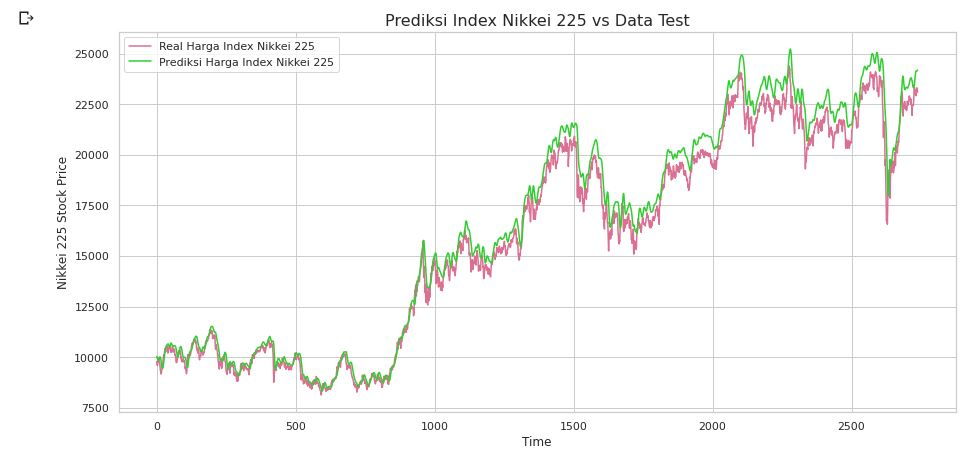

# Nikkei225Index_LSTM_Prediction
Predict Nikkei 225 Index with LSTM Model

Using Nikkei 225 Index from 1 Jan 1965 - 1 Sept 2020 which consists 14317 row, can be found on Yahoo! Finance  https://finance.yahoo.com/quote/%5EN225?p=^N225

# Dataframe Preview

Head of dataframe

Tail of dataframe

Information of dataframe

# Visualize Opening Prices

# Visualize Splitting Dataset 80% Train : 20% Test

# LSTM Model Layer

# Model Loss & MAE Plot
Loss plot : 

MAE plot :

# Model Evaluation with Coefficient Determination, MAE & MAPE

# Model Prediction VS Data Test

